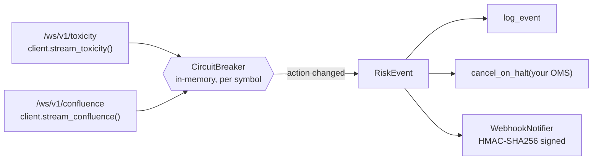

# HFT Toxicity Circuit Breaker

[](https://pypi.org/project/followsm-sdk/)
[](https://colab.research.google.com/github/Follow-SM/hft-toxicity-circuit-breaker/blob/main/quickstart.ipynb)
[](https://follow-sm.com/pricing)
[](LICENSE)

A kill switch for market makers, built on FollowSM's **Enterprise WebSocket streams** (`/ws/v1/toxicity` and `/ws/v1/confluence`).

It evaluates every Binance microstructure tick in memory. When order flow turns toxic, it fires **cancellation callbacks** and **signed webhooks** for your resting maker quotes, before informed traders pick them off.

```
12:01:42 WARNING | BTCUSDT NONE -> HALT_MAKER_QUOTES [toxicity] ob_toxicity_1pct 6.69 > 2.00 | vpin=0.186 pctl=- ob_tox_1pct=6.69 eval=32.1us feed_age=561ms
12:01:42 WARNING | KILL SWITCH: cancelling every resting maker quote on BTCUSDT
12:01:42 WARNING | ETHUSDT NONE -> HALT_MAKER_QUOTES [toxicity] ob_toxicity_1pct 4.99 > 2.00 | vpin=0.350 pctl=- ob_tox_1pct=4.99 eval=11.9us feed_age=561ms
11:30:47 WARNING | SOLUSDT WIDEN_SPREAD_2X -> HALT_MAKER_QUOTES [toxicity] ob_toxicity_1pct 2.90 > 2.00; 1% depth imbalance spike 0.26 vs ewma 0.48
Breaker evaluation latency: n=240 p50=7.1us p99=27.3us max=38.0us
```
<sub>Real output from the live Enterprise streams (`pctl=-`: `vpin_percentile` was still warming up).</sub>

---

## Why

Market makers lose money through **adverse selection**: their quotes get filled by traders who know more than they do. The damage clusters in short bursts, such as news shocks, liquidation cascades and prediction-market sweeps. In those bursts two things happen at once:

- **VPIN** (Volume-Synchronized Probability of Informed Trading) rises. Volume becomes one-sided within each fixed-volume bucket.
- **The top of the book thins out.** Resting liquidity within ±1% of mid turns lopsided, which shows up as `ob_toxicity_1pct` and the 1% depth-band `imbalance_ratio`.

This breaker watches both at tick level and pulls your quotes within microseconds of a frame arriving.

## How it works



The effective action for each symbol is the **more severe** of two legs.

| Leg | Source | Logic |
|---|---|---|
| **Toxicity** | `stream_toxicity()` → `SymbolToxicityMetrics` | `HALT_MAKER_QUOTES` if **any** of these holds: `vpin_percentile > VPIN_PERCENTILE_TRIP` (0.90); `ob_toxicity_1pct > OB_TOXICITY_TRIP` (2.0); the 1% depth `imbalance_ratio` deviates from its EWMA by more than `IMBALANCE_SPIKE` (0.20) |
| **Confluence** | `stream_confluence()` → `ConfluenceSnapshot` | **Local fallback evaluation** with `evaluate_risk_action(snapshot, RiskConfig(...))`. Your thresholds replace the backend's `recommended_action` |

- **Percentile, not raw VPIN.** Raw VPIN depends on each pair's trade-size distribution, so it can't share one threshold across symbols. FollowSM publishes `vpin_percentile`, which ranks VPIN against the symbol's own recent history, and the breaker trips on that. While a symbol is warming up and no percentile exists yet, it falls back to raw `VPIN_TRIP` / `VPIN_REARM`.
- **Hysteresis.** A tripped symbol re-arms only when `vpin_percentile < VPIN_PERCENTILE_REARM` (0.80) **and** no trip condition has occurred for `COOLDOWN_SECS`. This prevents flapping between halt and resume around the threshold.
- **Fail closed.** When a stream disconnects, every symbol it guards is halted immediately. The breaker then reconnects with exponential backoff, and fresh frames re-arm the symbols.
- **De-duplication.** `/ws/v1/toxicity` re-sends the full cache every second. Frames whose timestamp hasn't advanced are skipped.
- **Non-blocking callbacks.** Callbacks run as asyncio tasks with a timeout, so a slow webhook never delays evaluation of the next tick. Callbacks fire only on state **transitions**, never on every tick.

### Latency

The evaluation hot path is synchronous and has no I/O: compare, update the EWMA, then transition. FollowSM serves both streams from **sub-10ms in-memory snapshots**. The breaker reports its own rolling latency every 30 seconds:

```
Breaker evaluation latency: n=146 p50=4.7us p99=24.9us max=32.1us
```

`eval_latency_us` covers in-process decision time, from frame to scheduled callbacks. `feed_age_ms` is the wall-clock age of the snapshot when it arrived, which includes network time to your colocation. Both are included in every `RiskEvent`.

---

## Quickstart

```bash
git clone https://github.com/Follow-SM/hft-toxicity-circuit-breaker.git
cd hft-toxicity-circuit-breaker
python -m venv .venv && source .venv/bin/activate
pip install -r requirements.txt
cp .env.example .env         # set FOLLOWSM_API_KEY to an ENTERPRISE key
python -m circuit_breaker
```

No Enterprise key yet? The [Colab notebook](https://colab.research.google.com/github/Follow-SM/hft-toxicity-circuit-breaker/blob/main/quickstart.ipynb) replays live free-tier REST snapshots through the same breaker.

Offline tests (no network, no keys needed):

```bash
pip install pytest && pytest -q
```

### Wire it to your OMS

The example below uses the Polymarket CLOB as the venue being protected (`pip install py-clob-client`). Any `async def cancel_quotes(symbol)` works the same way.

```python
import asyncio
import os

from followsm_sdk import FollowSMClient
from py_clob_client.client import ClobClient
from py_clob_client.constants import POLYGON

from circuit_breaker.breaker import CircuitBreaker
from circuit_breaker.callbacks import WebhookNotifier, cancel_on_halt, log_event
from circuit_breaker.config import load_config
from circuit_breaker.streams import guard_stream

clob = ClobClient("https://clob.polymarket.com", chain_id=POLYGON, key=os.environ["POLYMARKET_PRIVATE_KEY"])
clob.set_api_creds(clob.create_or_derive_api_creds())


async def cancel_quotes(symbol: str) -> None:
    await asyncio.to_thread(clob.cancel_all)


async def main() -> None:
    config = load_config()
    client = FollowSMClient(api_key=config.followsm_api_key, risk_config=config.risk)
    callbacks = [log_event, cancel_on_halt(cancel_quotes)]
    if config.webhook_url:
        callbacks.append(WebhookNotifier(config.webhook_url, config.webhook_secret))
    breaker = CircuitBreaker(config, callbacks)
    await asyncio.gather(
        guard_stream("toxicity", breaker, client.stream_toxicity, breaker.on_toxicity),
        guard_stream("confluence", breaker, client.stream_confluence, breaker.on_confluence),
    )


asyncio.run(main())
```

### Webhook payload

Every transition is POSTed as JSON:

```json
{
  "symbol": "BTCUSDT",
  "action": "HALT_MAKER_QUOTES",
  "previous_action": "NONE",
  "source": "toxicity",
  "reasons": ["ob_toxicity_1pct 6.69 > 2.00"],
  "vpin": 0.186,
  "vpin_percentile": null,
  "ob_toxicity_1pct": 6.69,
  "imbalance_1pct": 0.13,
  "feed_age_ms": 561.0,
  "eval_latency_us": 32.1,
  "emitted_at": 1790416902.960
}
```

`source` is one of `toxicity`, `confluence` or `connection` (a stream dropped and the breaker failed closed). When `WEBHOOK_SECRET` is set, the header `X-FollowSM-Signature` carries `hex(HMAC-SHA256(secret, raw_body))`. Verify it with `hmac.compare_digest` before acting on the request.

### Configuration (`.env`)

| Variable | Default | Description |
|---|---|---|
| `FOLLOWSM_API_KEY` | *(required)* | **ENTERPRISE** key. Other tiers are rejected with HTTP 403 |
| `SYMBOLS` | `BTCUSDT,ETHUSDT,SOLUSDT` | Symbols to guard. Empty = everything on the stream |
| `VPIN_PERCENTILE_TRIP` / `VPIN_PERCENTILE_REARM` | `0.90` / `0.80` | Trip and re-arm thresholds on `vpin_percentile` (the hysteresis band) |
| `VPIN_TRIP` / `VPIN_REARM` | `0.85` / `0.75` | Raw-VPIN fallback while `vpin_percentile` is unavailable (set high: raw levels vary a lot between pairs) |
| `OB_TOXICITY_TRIP` | `2.0` | Ask/bid notional ratio within ±1% of mid |
| `IMBALANCE_SPIKE` | `0.20` | Maximum deviation of the 1% `imbalance_ratio` from its EWMA |
| `COOLDOWN_SECS` | `5` | Minimum clean time before re-arming |
| `VPIN_PERCENTILE_WIDEN_THRESHOLD` / `VPIN_PERCENTILE_HALT_THRESHOLD` / `VPIN_WIDEN_THRESHOLD` / `VPIN_HALT_THRESHOLD` / `MIN_SEMANTIC_CONFIDENCE` | `0.90` / `0.95` / `0.80` / `0.90` / `0.65` | Local fallback `RiskConfig` for confluence frames |
| `WEBHOOK_URL` / `WEBHOOK_SECRET` | *(empty)* | Optional signed webhook |

---

## Plans

| | Free | DEVELOPER ($199/mo) | **ENTERPRISE** ($499/mo) |
|---|---|---|---|
| REST requests/min | Limited (per IP) | 300 | 1,000 |
| Binance pairs | Limited | 50+ | 50+ |
| Snapshot latency | Standard | Sub-10ms in-memory | Sub-10ms in-memory |
| **WebSocket `/ws/v1/toxicity` + `/ws/v1/confluence`** | ❌ | ❌ | ✅ |

### 👉 [Get your ENTERPRISE API key at follow-sm.com/pricing](https://follow-sm.com/pricing)

## Related

- Research: [`research/vpin_case_study.py`](research/vpin_case_study.py) reproduces the 2026-08-22 BTC sweep case study (VPIN, taker imbalance, Polymarket repricing) from public data, with no keys needed
- Python SDK: [`pip install followsm-sdk`](https://pypi.org/project/followsm-sdk/)
- TypeScript SDK: [`npm install @followsm/sdk`](https://www.npmjs.com/package/@followsm/sdk)
- REST polling bot for Polymarket: [`polymarket-arbitrage-starter-kit`](https://github.com/Follow-SM/polymarket-arbitrage-starter-kit)

## Disclaimer

This is educational software, provided as-is under the [MIT License](LICENSE). It is not financial advice. A circuit breaker reduces risk but cannot eliminate it. Test against your own OMS in a sandbox before relying on it in production.
